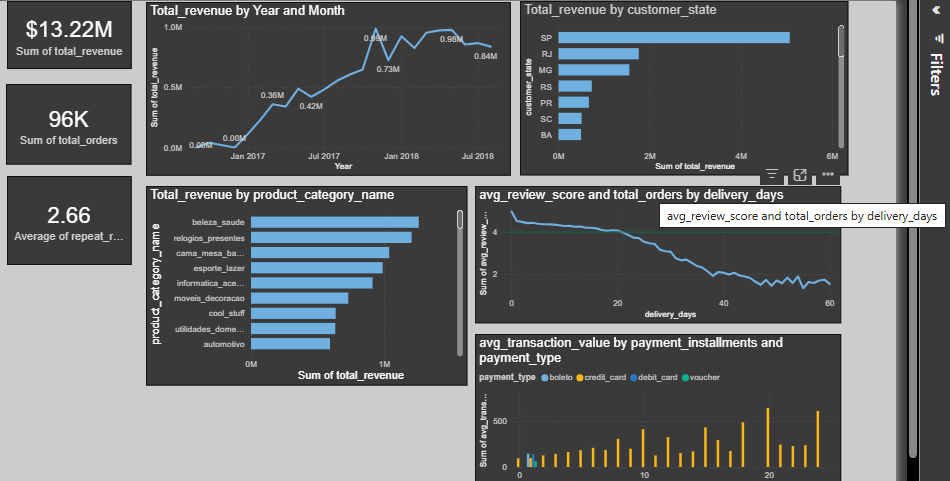

# E-Commerce Sales & Customer Analytics — SQL + Power BI

## Why I Built This

After finishing my first project (a Scope 1 GHG calculator in Excel), I wanted a harder test — something with real multi-table complexity instead of one clean sheet. This project uses a real, anonymized Brazilian e-commerce dataset (Olist) spanning ~100K orders across 2016-2018, split across multiple related tables: orders, customers, order items, products, sellers, payments, and reviews. The goal was to answer real business questions end to end — SQL first, then a proper data model and dashboard — the same way an analyst would work with actual company data, not a single flat file.

## Business Questions Answered

1. What's the monthly revenue and order volume trend across the dataset period?
2. Which product categories drive the most revenue, and does that match order volume?
3. Does delivery time affect customer review scores?
4. Which states/regions are strongest and weakest on revenue?
5. How does payment method and installment count relate to average order value?
6. What share of customers are repeat buyers?

## Data

**Source:** Olist Brazilian E-Commerce Public Dataset (Kaggle) — real, anonymized order data from an actual multi-category marketplace, 2016-2018.

## Methodology

**1. SQL (Google BigQuery)**
All 6 business questions were answered using SQL directly against the raw relational tables — joins, subqueries, and aggregations across orders, order items, customers, products, and reviews. Queries are saved in `queries.sql`, with each question's result also exported as a standalone CSV in `query_results/`.

**2. Data Model (Power BI)**
Built a proper star schema rather than a single flat table: a central fact table (order line items) connected to dimension tables for customers, products, sellers, and a continuous date table — enabling accurate time-based analysis and clean relationships between entities.

**3. DAX Measures**
Beyond basic sums, this project includes a properly calculated **Repeat Purchase Rate** measure — calculated at the customer level (distinct customers with more than one order, divided by total distinct customers), not a naive row-level sum, which would silently produce a meaningless inflated number. Getting this right — and catching it before it was wrong — was one of the more useful lessons from this project.

## Key Findings

- **Total revenue:** $13.22M across ~96K orders in the dataset window
- **Revenue trend:** Clear year-over-year growth from 2016 into 2017
- **Top product category by revenue:** beleza_saude (health & beauty)
- **Top-performing state:** São Paulo (SP), well ahead of other regions
- **Delivery time vs. satisfaction:** Average review score declines noticeably as delivery time increases
- **Repeat purchase rate:** [CONFIRM YOUR FINAL VERIFIED NUMBER HERE, e.g. 2.66%]

## Screenshots

```


```

## Tools Used

Google BigQuery (SQL) · Power BI (data modeling, DAX, dashboard design) · Power Query

## Notes

This project focuses on SQL and Power BI.

## Connect

Built by Ayesha Mohsin — [LinkedIn](www.linkedin.com/in/ayesha-mohsin-baa670362) | Open to remote freelance/internship opportunities in data analytics and BI.
